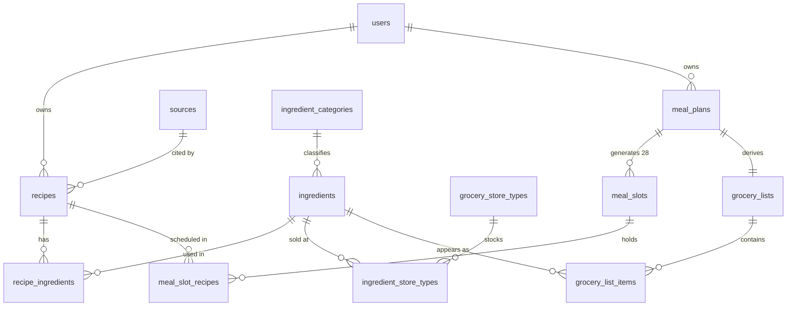

# 食谱管理 — Recipe Manager

A weekly meal-planning app for a two-person household. Save recipes, drop them onto a
week-long meal grid, and get a grocery list that assembles itself — grouped by which
store you actually buy each ingredient at.

<p>
  
  
  
  
  
</p>

> **A note on language:** the interface is in Simplified Chinese, because it was built
> for daily use in a bilingual household that shops at both Chinese and American grocery
> stores. That constraint is not cosmetic — it shapes the data model, which is described
> below. Code, comments, and this document are in English.

---

## The problem it solves

Meal planning apps generally stop at "here is a list of ingredients." That list is not
what you take to the store, for three reasons:

1. **You shop at more than one store.** Doubanjiang and Sichuan peppercorns come from the
   Chinese supermarket; the chicken and the milk come from the American one. A single flat
   list means sorting it in your head in the parking lot.
2. **You already own some of it.** Half the list is sitting in the pantry.
3. **The plan changes.** You swap Thursday's dinner on Tuesday night, and the list has to
   follow — without losing the "already have this" marks you made an hour ago.

This app handles all three. The meal plan is the source of truth; the grocery list is a
derived view that stays in sync as you edit.

---

## Screenshots

<!-- TODO: add screenshots. Suggested captures, in this order:
     1. Recipe index with the search + category filter
     2. The weekly meal-plan grid with recipes assigned
     3. The grocery list, showing store grouping and the pantry section
     Save them to docs/screenshots/ and reference them here. A short GIF of dragging a
     recipe into a slot and watching the grocery list update would carry the most weight. -->

_Coming soon._

---

## Features

**Recipes**
- Full CRUD with Markdown instructions: a write/preview tab pair rendered client-side with `marked`, and server-side rendering via Redcarpet on the recipe page
- 13 cuisine categories (beef, pork, poultry, seafood, vegan, Chinese staples, soup, bakery, dessert, salad, sandwich, pasta, sauce)
- Debounced name search and category filter, both driven from the same form without a page reload
- Ingredients are entered through an autocomplete that can create a new ingredient inline,
  in a modal, without leaving the recipe form — including assigning its category and which
  stores carry it
- Sources (cookbook, website, family) are managed the same way

**Meal plans**
- One plan per calendar week, validated to start on a Monday and end on the following Sunday
- Creating a plan generates all 28 slots (7 days × breakfast/lunch/dinner/snack) and an
  empty grocery list in a single `after_create` pass
- Multiple recipes per slot; add and remove via Turbo Streams that repaint only the affected cell
- Per-recipe "include in grocery list" toggle, so you can plan a restaurant meal or a
  leftovers night without it polluting the shopping list

**Grocery list**
- Rebuilt automatically whenever the plan changes
- Grouped by store, then by ingredient category within each store
- Occurrence counts — if three meals this week call for garlic, garlic shows a count of 3
- Pantry toggle moves an item to a separate "already have" section and, critically,
  **survives subsequent syncs**

**Accounts**
- Session-based auth with `has_secure_password`
- Recipes and meal plans are scoped to the current user; cross-user access is blocked at
  the controller level

---

## How the grocery list stays in sync

This is the part of the app worth reading. The naive implementation — rebuild the list from
scratch on every edit — loses the user's pantry marks every time, which makes the feature
useless in practice. Getting it right is a reconciliation problem, not a regeneration one.

[`SyncGroceryListService`](app/services/sync_grocery_list_service.rb) runs after every
mutation to a meal plan and performs a three-way diff:

```ruby
existing         = @grocery_list.grocery_list_items.index_by(&:ingredient_id)
stale_ids        = existing.keys - ingredient_counts.keys

# 1. delete what is no longer called for
# 2. update the count on what is still called for
# 3. create what is newly called for
#
# Items that persist across the diff are never touched, so `in_pantry` survives.
```

Three details make it work:

**Counting happens in the database, not in Ruby.** Occurrence counts come from a single
grouped query across the join:

```ruby
MealSlotRecipe
  .joins(:meal_slot)
  .where(meal_slots: { meal_plan_id: @meal_plan.id })
  .where(add_to_grocery_list: true)
  .group(:recipe_id)
  .count
```

**Deletes bypass callbacks.** Stale rows go out via `delete_all` on a scoped relation —
one statement, no per-row instantiation.

**Updates are conditional.** `item.update!(...) if item.occurrence_count != count` means a
sync that changes nothing writes nothing.

A unique index on `(grocery_list_id, ingredient_id)` backs the model-level uniqueness
validation, so the invariant holds even if two requests race.

The toggle path is subtler than it looks. When the same recipe appears in several slots
(Sunday's stew is also Monday's lunch), flipping "include in grocery list" on one of them
has to flip all of them — otherwise the count is wrong and the checkbox lies about the
state. `MealSlotRecipesController#update` finds every linked row in the plan, updates them
in one statement, re-syncs, and then returns a Turbo Stream per affected cell — deduped by
slot ID so a slot holding two copies isn't repainted twice.

---

## Data model



Thirteen tables. A few decisions worth calling out:

| Decision | Why |
| --- | --- |
| `ingredient_store_types` is a real join table, not an enum on `ingredients` | An ingredient can be available at more than one store, and the set of stores is user-editable data rather than a code constant. |
| `meal_slots` are created eagerly — all 28, on plan creation | The grid always renders the full week, so lazily creating slots would mean null-checking every cell in the view. Twenty-eight rows is cheap; branching in the template is not. |
| `add_to_grocery_list` lives on `meal_slot_recipes`, not on `recipes` | It's a property of *this recipe in this week's plan*, not of the recipe itself. |
| `occurrence_count` is stored, not computed on read | The grocery list is read far more often than the plan is edited, and the count is what the sync already computes. |
| `grocery_lists` has a unique index on `meal_plan_id` | Enforces the one-to-one at the database level rather than trusting `has_one`. |
| `restrict_with_error` on ingredients and sources | Deleting an ingredient that recipes depend on should fail loudly, not cascade silently. |

---

## Stack

| | |
| --- | --- |
| **Framework** | Rails 8.1 |
| **Language** | Ruby 3.2.2 |
| **Database** | PostgreSQL |
| **Frontend** | Hotwire (Turbo Streams + Stimulus), 11 Stimulus controllers, no build step for JS |
| **Assets** | Propshaft + importmap-rails |
| **Styling** | Tailwind CSS 4 |
| **Auth** | `has_secure_password` (bcrypt), session-based |
| **Background jobs / cache / cable** | Solid Queue, Solid Cache, Solid Cable — all Postgres-backed, no Redis |
| **Pagination** | Pagy |
| **Markdown** | Redcarpet server-side, `marked` for the in-form preview |
| **Deploy** | Kamal + Thruster, Dockerfile included |
| **CI** | GitHub Actions — Brakeman, bundler-audit, importmap audit, RuboCop (rails-omakase), tests |

No Redis, no Node build for application JavaScript. The whole thing runs on Postgres and a
Ruby process.

---

## Getting started

**Prerequisites:** Ruby 3.2.2, PostgreSQL 14+.

```bash
git clone https://github.com/<your-username>/recipe_management.git
cd recipe_management

bin/setup          # installs gems, prepares the database, starts the dev server
```

`bin/setup` ends by running `bin/dev`, which boots Rails and the Tailwind watcher together
(see `Procfile.dev`). Pass `--skip-server` if you'd rather start it yourself.

Then seed the reference data:

```bash
bin/rails db:seed
```

Seeds are idempotent and create the ingredient categories (spices, oils, cooking wine,
seasonings, flour, prepared foods, eggs and dairy, grains, mushrooms, fruit, vegetables,
meat), the two store types, and — in development only — an admin account:

```
username: admin
password: password
```

Visit http://localhost:3000 and log in.

**Running it manually:**

```bash
bundle install
bin/rails db:prepare
bin/rails db:seed
bin/dev
```

---

## Project layout

```
app/
├── controllers/          10 controllers, RESTful, thin
├── models/               13 models; validations and scopes, no business logic
├── services/
│   └── sync_grocery_list_service.rb    ← the reconciliation described above
├── javascript/controllers/             ← 11 Stimulus controllers
│   ├── autocomplete_controller.js        ingredient/source typeahead
│   ├── inline_create_controller.js       create-without-leaving-the-form
│   ├── markdown_preview_controller.js    live recipe instruction preview
│   ├── search_form_controller.js         debounced filter submission
│   ├── week_picker_controller.js         Monday-snapping date selection
│   └── …
└── views/
    ├── shared/           navbar, flash, pagination, modals, section cards
    └── …                 30 templates, partials extracted aggressively
```

Conventions for this codebase — service-object naming, partial extraction thresholds,
Stimulus controller scope, where to put shared behavior — are documented in
[`.claude/CLAUDE.md`](.claude/CLAUDE.md).

---

## Testing

Honest status: **the test suite is not written yet.** The CI pipeline is configured and
green for static analysis (Brakeman, bundler-audit, importmap audit, RuboCop), and the
Minitest jobs are wired up against a Postgres service container, but `test/` currently
holds only the Rails scaffolding.

Next up, in priority order:

- `SyncGroceryListService` — the reconciliation diff, pantry-flag preservation across
  syncs, occurrence counting with a recipe in multiple slots
- The linked-toggle path in `MealSlotRecipesController#update`
- Authorization scoping — a user cannot read or mutate another user's meal plan

---

## Roadmap

- [ ] Test coverage for the grocery sync and authorization paths
- [ ] Recipe photos — `image_processing` is already in the Gemfile, but Active Storage is not installed yet
- [ ] Quantity aggregation on the grocery list — currently it counts occurrences rather
      than summing quantities, because unit normalization ("2 cloves" + "1 tbsp minced")
      is a genuinely hard problem and the count is more useful than a wrong sum
- [ ] Copy a previous week's plan as a starting point for the next one
- [ ] Deployed demo instance

---

## License

Not yet licensed. Add a `LICENSE` file before making this public — without one the default
is "all rights reserved," which means nobody can legally use or fork it. MIT is the
conventional choice for a portfolio project.
